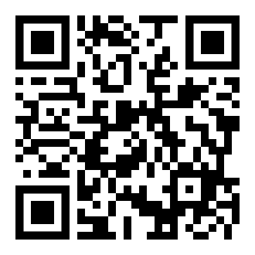

# Intro

Goal: 

*Build a foundation by using some of the most ubiquitous software
in the field.* 

We will cover four topics in this module:

1. Mathematical Typesetting and \LaTeX,
2. Python and Jupyter Notebooks,
3. Introduction to Programming,
4. Symbolic Computation and SageMath.


# Assessment

The total assessment of the course comprises $100\%$ of homework. There will be
four assignments, one for each of the four topics above. Each assignment will
contribute $25\%$ to the total. 

They will be due at 17:00 on the following dates:

1. 09 February, 
2. 23 February,
3. 08 March,
4. 29 March.

Will appear on Canvas and on the [module website](https://joshmaglione.com/2024CS3101.html)

{ width=80px }

# Mathematical typsetting and \LaTeX

How can we display mathematical symbols? 

For example:
$$\int_a^b f(x) dx = \lim_{ \| \Delta x \| \to 0} \sum_{i=1}^n f(x_i^*) \Delta x_i.$$

# Two styles

We now have essentially two main styles of software to
write mathematical formulae, diagrams, and images:

1. What-You-See-Is-What-You-Get (WYSIWYG) and
2. typesetting software (or write-format-preview style).

Software like *Microsoft Word*, *Apple Pages*, or *LibreOffice Writer* are WYSIWYG
editors because you see and edit the document as a final product (regardless of
whether or not it is the final product).

# \TeX\ and \LaTeX 

One of the first typesetting software for mathematics is \TeX---if not
\textit{the} first. It was written by *Donald Knuth* in 1978.

\TeX\ is the cornerstone of the more modern software \LaTeX\ written by *Leslie Lamport* in 1986.

Both \TeX\ and \LaTeX\ are free and open-source software. 

## Web and browser-based

For web-based mathematical symbols, MathJax is primarily used. However, there is a new, much faster, alternative called KaTeX.

# Overleaf (\#NotSponsored) 

We will primarily use [Overleaf](https://www.overleaf.com/) in this module. 

Overleaf is a website that enables users to interface with \LaTeX\ through cloud-based services. 

It uses a
``freeium'' model, so that everyone can use the basic features, which will be
sufficient for our module. 

The major advantage is that one does not have to
worry about installing and package management; all of this is done cloud-side.

Moreover Overleaf simplifies the workflow slightly by allowing for instant
compilation. 

# Workflow 

The basic workflow is perhaps only a little more complicated than how it might
be for WYSIWYG software.

### Basic workflow:

1. Create a \texttt{tex} file and write \LaTeX\ markup. 
2. Compile the \texttt{tex} file with the command \texttt{pdflatex}.
3. Sometimes errors are raised and need to be addressed. It is acceptable
	to cry when this happens; it happens to all of us. If no errors arise, then
	a \texttt{pdf} file is created (or overwritten). 
4. View and review the output \texttt{pdf} file.

# Document structure

The basic format of a \LaTeX\ document is simple.

The first command that appears in a functioning \texttt{tex} file is the following:

```latex
\documentclass[<options>]{<style>}
```

For example, the lecture notes have:

```latex
\documentclass[a4paper, 12pt]{article}
```

# Lab tasks

1. Set up an account on Overleaf.
2. Learn the basic workflow: create a project and a document; learn the editor.
3. Create a very simple \LaTeX\ source file, and compile it to pdf.
4. Learn how to download, upload, and share Overleaf documents. 
